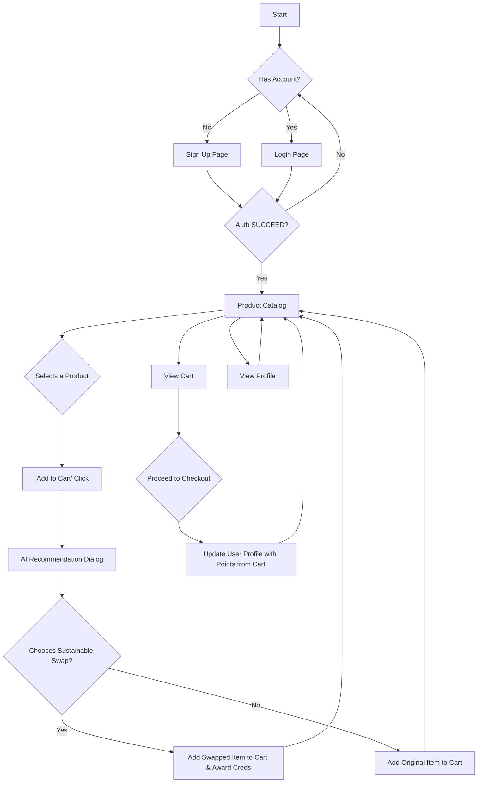

# EcoSwap - Sustainable Shopping App

**Project Goal:** EcoSwap is a Next.js web application designed to help users make more environmentally conscious purchasing decisions. It features a product catalog, user authentication, and an AI-powered recommendation system that suggests greener alternatives, rewarding users with "Eco Creds" for making sustainable choices.

This project was built in Firebase Studio.

## Key Features

-   **User Authentication**: Secure sign-up and login functionality. The application starts with a login/signup screen and features a dark, minimal UI with subtle, smooth animations.
-   **Product Catalog**: A filterable and searchable grid of products displaying name, carbon footprint, an organic badge, and a category badge.
-   **AI-Powered Recommendations**: When a user adds an item to their cart, a dialog appears with more sustainable alternatives. Each suggestion includes a compelling comparison paragraph (≤120 words) generated on-demand by the Gemini 1.5 Pro model.
-   **Gamification (Eco Creds)**: Users earn points for choosing sustainable products. A profile page displays their total lifetime points.

## Architecture & User Flow

The application uses a modern, integrated web stack featuring Next.js for the frontend and Genkit for the AI backend. All services, including authentication and the database, are managed through Firebase.

### How it Works

1.  **Frontend (Next.js & React)**: The user interface is built with React and Next.js, using the App Router convention (`src/app`). UI components from ShadCN (`src/components/ui`) and custom product components (`src/components/product`) create the visual experience, styled with Tailwind CSS. The overall aesthetic is dark, minimal, and professional.
2.  **Backend (Genkit & Firebase)**: The backend logic resides in a Genkit AI flow (`src/ai/flows`). When a user clicks "Add to Cart", the frontend calls this server-side flow.
3.  **AI Recommendation Process**:
    *   The flow receives the selected product's ID.
    *   It fetches the original product and other potential swaps from the same category in the **Firestore** database.
    *   It uses a Google AI embedding model (`text-embedding-004`) to find the top 4 most semantically similar products based on their descriptions. This ensures suggestions are relevant.
    *   It filters these results to keep only those with a lower carbon footprint.
    *   For each sustainable alternative, it calls the **Gemini 1.5 Pro** model to generate a persuasive comparison paragraph.
4.  **Data & State Management**: User data (authentication status, profile information, cart contents) is managed on the client-side using React Hooks and Context (`src/hooks`). This data is persisted in Firebase (Auth and Firestore) and the browser's local storage for a seamless user experience.

### User Flow Diagram



## File Structure Explained

```
.
├── README.md               # This documentation file
├── .gitignore              # Files to ignore for version control
├── next.config.js          # Next.js configuration
├── package.json            # Project dependencies and scripts
├── src/
│   ├── ai/                 # Genkit AI flows and configuration
│   │   ├── flows/
│   │   │   └── find-sustainable-swaps.ts # The AI flow for recommendations
│   │   ├── schemas.ts      # Zod schemas for AI flow inputs and outputs
│   │   └── genkit.ts       # Genkit global instance and plugin configuration
│   ├── app/                # Next.js App Router pages
│   ├── components/         # Reusable React components
│   ├── hooks/              # Custom React hooks for shared logic
│   └── lib/                # Shared utilities, types, and Firebase config
└── ...
```

## How to Run

### 1. Install Dependencies
```bash
npm install
```

### 2. Set Up Environment Variables
You will need two files for environment variables: `.env` for the server-side, and `.env.local` for the client-side.

**a. Server-Side Service Account (`.env`)**
The Genkit AI flows run on the server and need admin access to your Firebase project.
- Go to your **Firebase Project Settings > Service accounts**.
- Click "**Generate new private key**" and save the JSON file.
- Open the `.env` file in the project root.
- Copy the **entire contents** of the downloaded JSON file and paste it as the value for `FIREBASE_SERVICE_ACCOUNT_KEY`.

```env
# .env
FIREBASE_SERVICE_ACCOUNT_KEY={"type": "service_account", "project_id": "...", ...}
```

**b. Client-Side Firebase Config (`.env.local`)**
This connects your Firestore database and other Firebase services to the frontend.
- Create a file named `.env.local` in the project root.
- Go to your **Firebase Project Settings > General > Your apps > Web app**.
- Find your web app's configuration object and copy the keys into the `.env.local` file as shown below.
- You will also need to get an API key for Gemini from [Google AI Studio](https://aistudio.google.com/app/apikey).

```env
# .env.local
NEXT_PUBLIC_FIREBASE_API_KEY="YOUR_API_KEY"
NEXT_PUBLIC_FIREBASE_AUTH_DOMAIN="YOUR_AUTH_DOMAIN"
NEXT_PUBLIC_FIREBASE_PROJECT_ID="YOUR_PROJECT_ID"
NEXT_PUBLIC_FIREBASE_STORAGE_BUCKET="YOUR_STORAGE_BUCKET"
NEXT_PUBLIC_FIREBASE_MESSAGING_SENDER_ID="YOUR_SENDER_ID"
NEXT_PUBLIC_FIREBASE_APP_ID="YOUR_APP_ID"

# This key is used by the client and the server
GEMINI_API_KEY="YOUR_GEMINI_API_KEY"
```

### 3. Run the Development Server
This command starts the Next.js frontend and the Genkit backend together.
```bash
npm run dev
```
The application will be available at `http://localhost:9002`.
