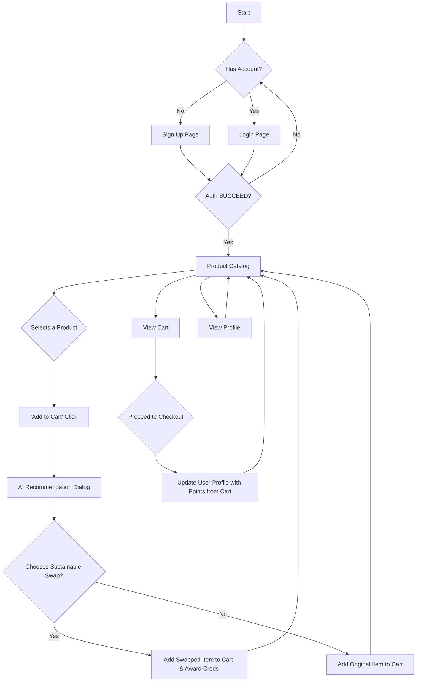

# EcoSwap – Consolidated Technical Documentation

EcoSwap is a Next.js application that helps users choose greener products. It shows AI-powered sustainable alternatives when an item is added to the cart, and awards Eco Creds for good choices.

This README is the single, consolidated documentation for the project. All previous docs have been merged here.

## Key Features

-   **User Authentication**: Secure sign-up and login functionality. The application starts with a login/signup screen and features a dark, minimal UI with subtle, smooth animations.
-   **Product Catalog**: A filterable and searchable grid of products displaying name, carbon footprint, an organic badge, and a category badge.
-   **AI-Powered Recommendations**: When a user adds an item to their cart, a dialog appears with more sustainable alternatives. Each suggestion includes a compelling comparison paragraph (≤120 words) generated on-demand by the Gemini 1.5 Pro model.
-   **Gamification (Eco Creds)**: Users earn points for choosing sustainable products. A profile page displays their total lifetime points.

## Architecture & User Flow

The application uses a modern, integrated web stack featuring Next.js for the frontend and server actions for AI. All services, including authentication and the database, are managed through Firebase.

### How it Works

1.  **Frontend (Next.js & React)**: The user interface is built with React and Next.js, using the App Router convention (`src/app`). UI components from ShadCN (`src/components/ui`) and custom product components (`src/components/product`) create the visual experience, styled with Tailwind CSS. The overall aesthetic is dark, minimal, and professional.
2.  **Backend (Server Actions & Firebase)**: The backend logic resides in a server action (`src/ai/flows/find-sustainable-swaps.ts`). When a user clicks "Add to Cart", the frontend calls this server-side function.
3.  **AI Recommendation Process (2-Step)**:
    *   The flow receives the selected product's ID.
    *   It fetches the original product and other candidates from the same category in **Firestore**.
    *   Step 1: It finds the Top-5 most semantically similar products (category match, keyword overlap, name similarity, semantic groups like tomato↔paste/sauce).
    *   Step 2: Among those 5, it picks the Top-2 most sustainable (carbon reduction, organic bonus, category bonus).
    *   It then calls **Gemini 1.5 Pro** to generate a short, persuasive comparison paragraph (either using DB carbon intensities or LCA estimation if missing).
4.  **Data & State Management**: User data (authentication status, profile information, cart contents) is managed on the client-side using React Hooks and Context (`src/hooks`). This data is persisted in Firebase (Auth and Firestore) and the browser's local storage for a seamless user experience.

### User Flow Diagram



## File Structure

```
.
├── README.md               # Consolidated documentation (this file)
├── .gitignore              # Files to ignore for version control
├── next.config.js          # Next.js configuration
├── package.json            # Project dependencies and scripts
├── src/
│   ├── ai/                 # AI flows and services
│   │   ├── flows/
│   │   │   └── find-sustainable-swaps.ts # Server action for recommendations
│   │   └── services/
│   │       └── gemini-service.ts         # Gemini dual-key integration
│   ├── app/                # Next.js App Router pages
│   ├── components/         # Reusable React components
│   ├── hooks/              # Custom React hooks for shared logic
│   └── lib/                # Shared utilities, types, and Firebase config
└── ...
```

## How to Run

### 1. Install Dependencies
```bash
npm install
```

### 2. Set Up Environment Variables
You will need two files for environment variables: `.env` for server-only variables, and `.env.local` for client-safe variables.

**a. Server-Side (`.env`)**
Server actions need admin access to your Firebase project and Gemini keys (dual-key setup).
- Go to your **Firebase Project Settings > Service accounts**.
- Click "**Generate new private key**" and save the JSON file.
- Open the `.env` file in the project root.
- Copy the **entire contents** of the downloaded JSON file and paste it as the value for `FIREBASE_SERVICE_ACCOUNT_KEY`.

```env
# .env
FIREBASE_SERVICE_ACCOUNT_KEY={"type": "service_account", "project_id": "...", ...}
GEMINI_API_KEY_SEARCH="your-semantic-search-api-key"   # optional for embeddings
GEMINI_API_KEY_COMPARE="your-comparison-generation-api-key"  # for gemini-1.5-pro
```

**b. Client-Side (`.env.local`)**
This connects your Firestore database and other Firebase services to the frontend.
- Create a file named `.env.local` in the project root.
- Go to your **Firebase Project Settings > General > Your apps > Web app**.
- Find your web app's configuration object and copy the keys into the `.env.local` file as shown below.
- You will also need to get an API key for Gemini from [Google AI Studio](https://aistudio.google.com/app/apikey).

```env
# .env.local
NEXT_PUBLIC_FIREBASE_API_KEY="YOUR_API_KEY"
NEXT_PUBLIC_FIREBASE_AUTH_DOMAIN="YOUR_AUTH_DOMAIN"
NEXT_PUBLIC_FIREBASE_PROJECT_ID="YOUR_PROJECT_ID"
NEXT_PUBLIC_FIREBASE_STORAGE_BUCKET="YOUR_STORAGE_BUCKET"
NEXT_PUBLIC_FIREBASE_MESSAGING_SENDER_ID="YOUR_SENDER_ID"
NEXT_PUBLIC_FIREBASE_APP_ID="YOUR_APP_ID"

# No AI keys in client env
```

### 3. Run the Development Server
This command starts the Next.js app locally (package.json runs on port 9002).
```bash
npm run dev
```
Open http://localhost:9002

---

## AI Workflow (Detailed)

All logic lives in:
- Server action: `src/ai/flows/find-sustainable-swaps.ts`
- AI service: `src/ai/services/gemini-service.ts`

### Step 1 – Semantic Similarity (Top-5)
- Exclude the original product by ID
- Score candidates within the same category using:
  - Category match: +40
  - Description keyword overlap: up to +35
  - Name word overlap: up to +15
  - Semantic group bonus (e.g., tomato ↔ paste/sauce/juice/ketchup): up to +10
- Keep only meaningful matches (score > 15), then take Top-5

### Step 2 – Sustainability Ranking (Pick Top-2)
- On the Top-5, compute a sustainability score:
  - Carbon reduction vs original: up to 60%
  - Organic bonus: 25%
  - Category bonus (e.g., Produce/Grains): 15%
- Return Top-2

### Step 3 – Persuasive Comparison (Gemini `gemini-1.5-pro`)
- If both products have `carbonIntensity` in DB: generate a short (~80 words), simple paragraph quantifying the improvement (plain language)
- If not: instruct LCA methodology (3-bucket PCF) to estimate, then produce the same style paragraph

---

## Minimal Start Scripts

Windows (create `start-dev.bat` next to this file):

```bat
@echo off
cd /d "%~dp0"
npm run dev
pause
```

Bash (create `start-dev.sh` next to this file):

```bash
#!/usr/bin/env bash
set -euo pipefail
cd "$(dirname "$0")"
npm install
npm run dev
```
